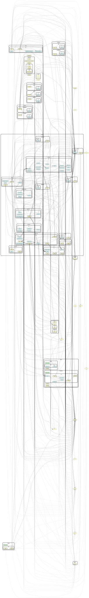

# Architecture

This document is for someone who did not write this code and has to change it safely.
Read it before adding a tool, a domain or a package. `CONTRIBUTING.md` is the how-to;
this is the why.

## The four layers

Every package has the same shape. Imports travel in one direction only, and
`.dependency-cruiser.cjs` fails the build when they do not.

| Layer      | Folder                | Holds                                                                                                                                            | May import                                                  |
| ---------- | --------------------- | ------------------------------------------------------------------------------------------------------------------------------------------------ | ----------------------------------------------------------- |
| shared     | `src/shared/`         | pure helpers with no domain knowledge; in core-tools the `redaction/` modules                                                                    | node built-ins, third-party packages, `@harness/shared`     |
| domain     | `src/domain/<name>/`  | one folder per domain: `types.ts` first, then `repository.ts` (SQL), pure logic modules, `prompts.ts` where a model is involved, and the tests   | `shared/`, other domains' `types.ts` and exported functions |
| tools      | `src/tools/<name>.ts` | `defineTool` calls only: validate input, call the domain, shape output. No SQL, no regex, no prompt strings                                      | `domain/`, `shared/`                                        |
| app        | `src/app/`            | `server.ts` (the composition root: dependencies from the environment, pack loading, tool registration), `main.ts` (the process entrypoint), CLIs | everything                                                  |
| public API | `src/index.ts`        | the only module other packages may import, alongside the subpaths `package.json#exports` declares                                                | `domain/`, `tools/`, `shared/` — never `app/`               |

Two conventions keep the tree readable:

- A domain that needs one module is one file, `src/domain/<name>.ts`. It gets a folder as
  soon as it needs a second module or a `types.ts` shared between them.
- Files are named for what they do — `types.ts`, `repository.ts`, `render.ts`, `prompts.ts`,
  `layout.ts` — never for the package or the folder they sit in. Two files in one package
  never share a basename unless they do the same job for different domains.

## The packages



Regenerate with `pnpm arch:graph` (needs Graphviz). Every arrow is an import that `pnpm arch`
allows, and the graph is cruised from the same globs as the gate, so the two cannot disagree.
Each package's layer folders are collapsed to one node apiece; `index.ts` is left on its own,
because it is the node every cross-package arrow should land on.

```
harness/shared      generic helpers: env, errors, paths, log, subprocess, jsonl, csv.
                    No domain knowledge, no workspace dependency. Bottom of the graph.
harness/pack-api    the Pack contract and definePack(). Depends on @harness/shared and zod
                    only, so a pack never has to depend on core-tools.
harness/config-api  the ClientDocument contract: the schema, blueprint + overlay + lock set,
                    resolve(), and the ConfigSource interface a source implements. Depends on
                    @harness/shared, @harness/identity-api and @harness/pack-api only.
harness/config-files a ConfigSource that reads HARNESS_CLIENTS_DIR/<id>/client.yaml, with
                    !include for the persona and the skills.
harness/config-postgres a ConfigSource over versioned rows: client_documents (one live row per
                    client) and client_document_versions (the history).
harness/db          schema, migrations, the pool, the encryption primitives.
harness/gateway     the routing schema and the LiteLLM config renderer.
harness/surface-api the Surface contract and defineSurface(): cards, forms, conversations, and
                    MemorySurface under its testing subpath. Depends on @harness/shared and zod.
harness/identity-api the Identity contract and defineIdentityProvider(): Principal, the five
                    levels (declared in @harness/shared), IdentitySession, and StaticIdentity
                    under its testing subpath. Depends on @harness/shared and zod.
harness/files       the parsing worker: pdftotext, pdftoppm and tesseract behind one HTTP route,
                    in a process with no key, no database and no route out. Depends on
                    @harness/shared only.
harness/runtime-api the Runtime contract and defineRuntime(): RunRequest, RunEvent,
                    RuntimeSession; the ScriptedRuntime, the fake OpenAI-wire gateway and the
                    conformance kit under its testing subpath. Depends on @harness/shared, zod
                    and the MCP client type.
harness/core-tools  the MCP server: the pack-agnostic kernel, every domain, every kernel tool.
harness/approvals   a library the host composes: cards, decisions, the poller, the sinks, the
                    runner, health, the in-process core-tools client. Loads its messaging
                    adapters by name, from the surfaces the caller's client document declares.
harness/host        a pool of tenants: loads each client's runtime, surfaces and identity
                    plug-in by name from its document, runs one conversation turn per message,
                    and resumes a thread when an approval is decided.
surfaces/slack      the Slack adapter: Block Kit, Bolt in Socket Mode, the Web API slice.
surfaces/memory     the in-process adapter: no transport, used by the suite and for local runs.
surfaces/http       the surface a headless caller speaks as; opens no socket, posts nothing, and
                    exists so a run driven over the run API has a thread key and an identity
                    namespace.
identities/static   the identity plug-in that answers for the principals a client document's
                    identity section declares, plus its surface defaults.
identities/slack-groups the identity plug-in that resolves a level from a Slack workspace's own
                    user groups, through a SurfaceDirectory rather than a list of people.
runtimes/deepagents the Deep Agents JS runtime, behind the runtime contract: the only place
                    deepagents, langchain and langgraph may be spelled.
runtimes/scripted   a runtime plug-in that replays a script instead of asking a model; what a
                    host test drives so the suite proves the real loader against a real plug-in.
evals               the eval runner, scorers, judge and report.
packs/healthcare    a pack: the provider record kind, credential attachment kinds, form
                    templates, skills, the synthetic corpus, and eighteen tools
packs/stories       the proof pack: one record kind, one document kind, one skill, no tools
scripts             the client scaffolder: pnpm new-client writes a document.
```

The dependency graph in one line per layer, with every arrow pointing at something lower:

```
shared  <-  pack-api  <-  { core-tools, packs/* }
shared  <-  identity-api  <-  { config-api, core-tools, host, identities/* }
{ shared, identity-api, pack-api }  <-  config-api  <-  { config-files, config-postgres, core-tools,
                                                          gateway, host, scripts }
shared  <-  surface-api  <-  { approvals, host, surfaces/* }
shared  <-  runtime-api  <-  { host, runtimes/* }
shared  <-  files
shared  <-  db  <-  { config-postgres, core-tools, gateway }
{ config-api, config-files, config-postgres, db }  <-  core-tools  <-  { approvals, host, evals, gateway }
{ core-tools, approvals, runtime-api, identity-api, surface-api, config-api }  <-  host
core-tools  ..>  packs/*        (runtime only: dynamic import, never a static one)
core-tools  ..>  identities/*   (runtime only: dynamic import from the document's identityPlugin.kind)
evals       ..>  packs/*        (runtime only: --packs, --pack; no static import)
approvals   ..>  surfaces/*     (runtime only: dynamic import from the document's surfaces, never a
                                 static import)
host        ..>  { surfaces/*, identities/*, runtimes/* }   (runtime only: dynamic import from the
                                                              document's surfaces, identityPlugin
                                                              and runtime; never a static import)
```

`@harness/config-api` is the contract a `ConfigSource` implements and the one every reader of a
client document imports; it is what keeps `core-tools`, `gateway`, `host` and `scripts` agreeing
on what a document is without importing each other. `@harness/gateway` is no longer the one
package with no edge to `@harness/shared`: `pnpm gateway:config` now opens the client's own
`ConfigSource` through `@harness/core-tools`, which is where that edge, and the one to
`@harness/db`, come from.

`scripts` is a leaf. There are no cycles.

## The client document

A client is one document, validated against one schema (`@harness/config-api`), and it is not in
this repository. It carries the persona, the principals and the level each surface gives everyone
else, the policy and the tools the client withholds, the model routing, the playbooks, the skills,
where the knowledge comes from, which surfaces the client serves, which identity plug-in and
runtime it loads, and which packs. Onboarding a client writes a document; it changes nothing here.

A document reaches a host through a **`ConfigSource`**. Two ship: `files`, which reads
`HARNESS_CLIENTS_DIR/<id>/client.yaml` — with `!include` for the persona and the skills, so the
prose a person edits is prose in a file — and `postgres`, which reads versioned rows the platform
writes. `HARNESS_CONFIG_SOURCE` picks one and has no default, because a host that guessed would
start and serve nobody.

A **blueprint** is a complete document with placeholders and a **lock set** of JSON pointers; an
**overlay** is a tenant's edits as a small JSON Patch. `resolve(blueprint, overlay)` applies the
patch and refuses any operation that touches a locked pointer, naming both. A finished agent and a
customisable one are the same object with different locks, and a subscription tier is a lock set.

`clients/fixture/` is the one client in this repository. It exists so the suite has a document to
read, and the scaffolder has one to copy.

## The kernel and a pack

`@harness/core-tools` is a kernel. It knows about documents, records, attachments, deadlines,
approvals, audit and effects, and it knows nothing about medicine. A **pack** is an area of the
product — healthcare credentialing today, document scanning that produces epics tomorrow — and
it is the only place a domain word appears.

`harness/core-tools/src/kernel-vocabulary.test.ts` is what makes that a fact rather than an
intention: it greps the kernel's own source, and `evals/src`, for `provider`, `credential`,
`licence` or `license`, `npi`, `nppes`, `malpractice`, `dea_number`, `payer` and `roster`. Tests are
excluded, because a test names what it tests, and so is `shared/redaction/`, whose
`RESTRICTED_NAME_KEYS` is a list of identifier stems the kernel keeps on purpose. **Its
allowlist is empty.** A word that has to appear belongs in a pack.

`buildKernelConfig(document, env)` reads the client document's own `packs` — package names, and an
empty list for a client with no pack at all — and `loadPacks` (`domain/packs/registry.ts`) imports
each one dynamically into a `PackRegistry` on `ToolDeps`. No shipping module under
`harness/core-tools/src/` names a pack: `pnpm arch` fails the build on a static `@harness/pack-*`
import, with `src/testing.ts` and `*.test.ts` exempt because they need a registry synchronously.
`evals/src` is held to the same rule, exempting `*.test.ts` and `*.test-helpers.ts`, and the
runner reaches a pack only through `--packs` and `--pack`.

Those exemptions are the only reason the module graph shows an arrow from core-tools, or from
evals, to a pack at all — the graph collapses each package's layers to one node, tests included.
Remove the tests and both arrows go with them.

### The record model

One set of tables carries every pack's data, and `harness/db/src/domain/schema.ts` is where
they are declared.

| Table         | What it holds                                                                                        |
| ------------- | ---------------------------------------------------------------------------------------------------- |
| `records`     | `pack`, `kind`, `name`, `external_id`, `status`, client-scoped. A provider, an epic.                 |
| `fields`      | one name/value per record, plaintext `value` or `value_encrypted`, with a confidence and a status    |
| `attachments` | `kind`, `issuer`, `state`, dates, `number_encrypted`, `properties jsonb`. A licence, a link.         |
| `deadlines`   | keyed on an attachment: one `expiration` row and, when the kind has a lead time, one `renewal_start` |
| `documents`   | unchanged, attached to a record rather than to a provider                                            |

`deadlines` keeps the columns it has always had, `window_days` and `notified_at`. The lead time
is not a column at all: it is `AttachmentKindSpec.leadDays`, which a pack declares and
`computeDeadlines` (`domain/deadlines/compute.ts`) reads at compute time. **Zero lead days means
no renewal deadline**, and an attachment with no `expires_at` gets no deadline of either kind —
the honest answers for a link to a ticket, which is what the stories pack's `source_link` is.

A pack declares what may go in these tables — `RecordKindSpec` and `AttachmentKindSpec` in
`@harness/pack-api` — and ships no migration. `records_upsert` takes its `kind` as an enum built
from the loaded registry, so a kind no loaded pack declares is refused before it can become a
row nothing reads back.

Restricted values live in `bytea` and nowhere else. `records.name`, `records.external_id`,
`fields.value` and `attachments.properties` are plaintext, and `defineRecordKind` refuses a
record kind whose name field or external id is a restricted field, so the rule is checked at
startup rather than discovered in a leak. `fields.value` is diverted into `value_encrypted` when
its name is restricted; `attachments.properties` has no such column and no masked read-back, so
`upsertAttachment` refuses a property key the restricted-name rule recognises and says the value
belongs in the attachment's encrypted `number` instead.

### What a pack declares

`Pack` is in `harness/pack-api/src/types.ts`, the leaf module that holds every declaration on
the contract's own reference cycle.

```ts
export const pack = definePack({
  name,
  version,
  records, // RawRecordKind[]: kinds, their field manifests, their name fields
  attachments, // RawAttachmentKind[]: kinds and their lead days
  documentKinds, // what documents_classify may return
  extraction, // per document kind → target record kind, plus the prose the model reads
  formsDir, // optional
  skillsDir,
  policy, // Partial<Policy>: carried, not merged. See below.
  replaces, // kernel tool names this pack's own tools supersede
  tools, // (deps: PackToolDeps) => AnyToolDef[]
  evals, // PackEvals: corpus, cases, intake skill, judged fields, readback
});
```

The record and attachment kinds are handed over **unparsed**. The registry parses each one once,
at construction, against _this build's_ restricted-name rules, because those rules decide what
gets encrypted and so belong to whoever does the encrypting.

### Which pack receives a document

`PackRegistry.targetFor` resolves a classified document to one extraction target, in this order:
an exact claim on the document's kind; then a declared `"*"` catch-all, if any loaded pack has
one; then, **for a document with no kind at all**, the primary pack's first target. A kind that
was declared and claimed by nobody is a `ToolError` from `documents_extract` naming the kind,
not a document quietly written as the wrong record kind.

The **primary pack** is the first entry of the client document's `packs` list. It answers `manifest()`,
`formsDir()` and that unclassified-document target; a client with no pack has no primary pack,
and each of those three then names what is missing rather than reading off an empty list.
Nothing else depends on load order: `registryOf` refuses two loaded packs that claim the same
document kind, with `"*"` counted as a kind, so at most one exact claim and at most one
catch-all can exist. No pack declares a catch-all today; healthcare claims its five kinds by
name.

### How the catalogue is built

`createCoreToolsServer` builds two lists, and the difference between them is the whole design.

- **`deps.kernelTools`** — every tool the kernel defines, by its kernel name, filled before any
  replacement. A pack's wrapper calls the handler it wraps through this map.
- **`deps.tools`** — what is published to MCP, which is also what `approvals_execute` replays a
  parked action from.

Four rules turn the first into the second, and `domain/packs/publication.ts` is where each of
them fails loudly. The generic `records_*` tools are published only when at least one loaded
record kind leaves `genericTools` true. A kernel tool named in a loaded pack's `replaces` is
dropped, and a name that is not a kernel tool is a `ConfigError` rather than a silent no-op. Two
sources may not publish, or replace, the same name. And a source that replaces a name must
publish it: a name listed in `replaces` and missing from the catalogue the pack returns would
otherwise delete the kernel's tool and leave nothing behind it.

The kernel defines twenty-two tools. A healthcare-only deployment therefore publishes ten of
them and eighteen of the pack's — twenty-eight — and twelve of those eighteen are wrappers that
reproduce the pre-Plan-5 names and schemas byte for byte; `docs/architecture/tool-surface.json`
is what proves it. Load the stories pack beside it and the catalogue grows to thirty-three, by
the five `records_*` tools, because the `epic` kind wants them.

A wrapper that reshapes a result builds its **output schema from `deps`**. `replaces` is
process-wide, so healthcare's `documents_get`, `documents_list` and `documents_extract` also see
another pack's documents; each publishes the narrow pre-Plan-5 schema when no foreign document
kind is loaded and a widened one when there is, and passes a foreign document through in the
kernel's words rather than renaming an epic into a provider.

### What a pack cannot do

It cannot import `@harness/core-tools` or `@harness/db`; `pnpm arch` fails the build on either.
It has no database handle and no SQL. Everything it reads and writes goes through a kernel tool,
which is what keeps client scoping, the confidence threshold, the verified-field rule and the
encryption decision in one place. The kernel operations that are **not** tools — writing a
generated file into the out tree, staging a release, and the two redaction primitives
`isRestrictedName` and `MASKED` — arrive on `deps.kernel`, whose one implementation is
`PACK_KERNEL` in `domain/packs/kernel.ts`.

A pack reads configuration from `deps.env`, never from `process.env`; the ESLint rule enforces
it. Whoever builds the dependency bag decides what a pack sees, which is why an eval run on a
developer's filled-in `.env` cannot switch an outbound lookup on.

`Pack.policy` is part of the contract but `mergePolicy` (`domain/tooling/policy.ts`) does not
read it yet: `deps.policy` is `DEFAULT_POLICY` merged with the client document's own `policy`
section only. A pack's policy is carried, not merged, unchanged from Plan 4's ruling.

`CONTRIBUTING.md`, "Adding a pack", is the worked how-to, with `packs/stories` as the example.

## Surfaces

A **surface** is a place a human is talked to: Slack today, Microsoft Teams or Telegram next.
`@harness/host` is the _host_ now — it decides what to say and when, for both a conversation and
an approval card — and it holds no transport at all. `@harness/surface-api` is the contract
between them, and it is the same shape as the pack contract for the same reasons: a leaf package
depending on `@harness/shared` and zod, so an adapter never has to depend on the host, so the
host can load it by name at runtime.

```ts
export const surface = defineSurface({
  name, // lowercase; stored in approvals.surface
  version,
  secrets, // env names that are credentials
  connect, // (deps: SurfaceDeps) => Promise<SurfaceSession>
});
```

A `SurfaceSession` posts and updates a card, posts text (optionally as a reply to a message),
sends a private note, uploads a file, opens a form where it can, delivers actions and form
submissions back, and — as of Plan 8 — delivers an inbound human message: `onMessage` registers
the one handler for a `MessageEvent`, `startStream` begins a streamed reply (throwing
`SurfaceError` when the surface cannot stream), and `typing`, where the surface supports it, shows
that a reply is coming. `SurfaceCapabilities` gained two flags for this: `streaming` and
`inlineConfirm` (a card's buttons in the conversation the question was asked in — unused until a
surface has it). Everything a session takes is neutral: a `Card` is a title, a subtitle, body
lines and actions; a `NotePart` is text, a code span, a timestamp, a mention or an outcome icon.
Which of those becomes a Block Kit `context` block, an Adaptive Card `TextBlock` or a line of HTML
is the adapter's business, and `harness/approvals/src/host-vocabulary.test.ts` fails the build if
the host learns the difference.

**The primary surface** is the first surface the schema orders in the client document's `surfaces`
section (`SURFACE_ORDER`: `slack`, `memory`, `http`, so `http` — which cannot post a card — is
always last). Approval cards are posted there and only there: one approval, one card, one place
to answer it. Every loaded surface is still
live — a decision is accepted from whichever surface posted the card, which `approvals.surface`
records, and a staged effect may name any loaded surface in its payload.

**Capabilities, not attempts.** `SurfaceCapabilities` says whether this surface can open a form,
send a private reply and edit a message. The host reads them: a surface without forms gets an
approval card with two buttons instead of three, rather than an Edit button that fails.

**Who may decide is the identity plug-in's answer.** A decision is accepted only from a principal
of `kind: 'user'` at level `lead` or above, resolved from the surface user id on the surface the
card was posted on; a service principal cannot approve. There is no allowlist and no bypass. A
Teams identity and a Slack identity are different people until the identity plug-in says
otherwise, because `resolve({ surface, userId })` takes the surface name as part of the lookup.

**Addressing.** `approvals` carries `surface`, `conversation_id` and `message_ref` (migration
0009); `conversation_id` doubles as the poller's claim marker. An effect carries `surface` and
`conversation` in its payload, and the host's two generic sinks — `surface_message` and
`surface_file` — resolve them, falling back to the primary surface and its default conversation.
The kernel's `harness_notify` and the healthcare pack's `forms_release` keep their `channel`
argument name, because skills use it, but validate it only as a conversation-id _shape_
(`CONVERSATION_ID_PATTERN`, in `@harness/shared` so both contracts can reach it): the kernel
cannot know a surface's id format, so the adapter checks at dispatch and a bad id fails that one
effect, visible through `harness_reconcile`. A shape that loose admits an SSN, an EIN and a DEA
registration, so both staging tools run the restricted-pattern guard over the conversation id and
the surface name as well as over the text, and the adapter's complaint about an id it rejects
never quotes the id: both the id and the complaint are stored in plaintext.

**A card that was accepted is not a card that failed.** An adapter whose transport takes a card
and answers with nothing to address it by rejects `postCard` with `SurfaceAcceptedError`. The
poller keeps its claim on that row rather than release it, because a card with working buttons is
already in the conversation and the next tick would put a second one beside it; the two-minute
stale sweep recovers the row instead. A plain `SurfaceError` from `postCard` means the opposite —
nothing was sent — and does release the claim.

`CONTRIBUTING.md`, "Adding a surface", is the worked how-to, with `surfaces/memory` as the example.

## Identity

A **principal** is who a run acts as: a person, or a service identity for a scheduled job. It
is resolved by an **identity plug-in** loaded by name from the client document's own
`identityPlugin.kind` — the same shape as a pack and a surface, for the same reasons — and bound
to the run by whoever opens it: the stdio server from `HARNESS_PRINCIPAL` at startup, the host
once per turn — `handleMessage`
resolves `{ surface, userId }` before anything else runs, and an unresolved sender gets one
refusal and one audit row, never a run. A tool reads `deps.principal`. Nothing a model sends can
set it; there is no tool to, and `harness/core-tools/src/tools/harness.test.ts` asserts that no
published input schema mentions one.

`@harness/identity-api` is the contract. `Principal { id, kind, level, displayName, surfaces,
attributes }`; `IdentitySession.resolve({ surface, userId })` answers a principal or null, and
null means "not authorised", never a guest. The five levels — `member`, `practitioner`, `lead`,
`admin`, `service` — are declared in `@harness/shared` because `@harness/pack-api`'s policy
matrix is keyed by them too and the two contracts may not import each other. `approvals.decided_by`
is a principal id too, the same shape as `requested_by`; the card and the thread reply show the
deciding principal's display name, never the bare id.

**Policy is a matrix.** `Policy { classes, levels }`: `classes` is the row every level starts
from and `levels.<level>.<class>` is where a level differs; `decide(actionClass, level, policy)`
reads the level's cell first. `DEFAULT_POLICY` in `domain/tooling/policy.ts` is spec 4.4's
table, with its practitioner row equal to the flat table the kernel shipped before levels
existed. A client document's `policy.classes` entry replaces the kernel's `classes` default for
that class; a kernel or client `levels` cell always wins over `classes` for that level, so
`classes:` alone never loosens or tightens a level the kernel already gives its own cell —
`levels.member.destructive: blocked` and `levels.service.write.assign: approval` ship in
`DEFAULT_POLICY` and only a `levels:` block of the client's own can move them:

```yaml
levels:
  member: { destructive: approval }
```

**One `RunContext` per run.** `openRun` writes the `runs` row — `principal_id`, `surface`,
`conversation`, `thread_id` — and returns the context every audit row, effect and model call
of that run carries. `buildKernelConfig()` does the startup-only work once; `depsForRun(config,
{ db, principal, context })` clones it per run. The stdio server opens one run per process.

`identities/static` is the first plug-in: it reads no file and no environment variable. It is
handed the client document's already-validated `identity` section — `parseIdentityFileWithDefaults`
applies the rules zod cannot say (a duplicate id, a user without a `u-` id or a service without
`svc-`, a user at level `service`, two principals claiming one surface user id, and a `defaults`
entry on the run API surface) — and answers for the declared principals plus, on a surface
`identity.defaults` names, an undeclared caller at that surface's default level, under an id
`principalFromDefault` derives from theirs. `CONTRIBUTING.md`, "Adding an identity provider", is
the worked how-to.

A document may also give a surface a **default level**: everyone that surface admits who is not
declared acts at that level, under a principal id derived from their surface user id —
`u-<surface>-<slug>-<8 hex of sha256>` — so the same person is the same principal across restarts
and across processes, and every audit row, approval and run they leave behind is still theirs
tomorrow. The digest is what makes the derivation injective: lowercasing and replacing punctuation
maps many user ids onto one slug, and two people sharing one principal id would share one memory
and one audit trail. `http` may never have a default: the run API authenticates with one shared
bearer token, so a default there would let one token holder mint principals at will.

Levels can also come from **groups rather than lists**. `identities/slack-groups` maps a surface's
own user groups to levels, in order, with named exceptions on top and the document's defaults
underneath, cached for `sync.everySeconds`. Three hundred people are six lines of configuration: a
new hire joins a group and exists, a leaver falls to the default or to refusal. It never imports a
surface — `pnpm arch` forbids the edge — and receives a narrow `SurfaceDirectory` (`groupsOf`,
`displayNameOf`) through `IdentityDeps` instead, which is why one implementation will serve any
transport whose workspace has a notion of a group.

## Knowledge

`knowledge_documents` is one row per markdown file of the directory the client document's
`knowledge` section names (`{ source: 'dir', path }`, resolved onto `ToolDeps.knowledgeDir`; a
client whose section is `{ source: 'store' }` has none), keyed by its path within the source;
`knowledge_chunks` is one row per retrievable passage, with a generated `tsvector` and a
`vector(1024)` embedding from the gateway's `embed` route.

A chunk carries a **copy** of its document's `min_level`, `min_rank` and `principals`. That
denormalisation is the design, not an oversight: the access filter has to sit in the same `WHERE`
clause as the ranking, so a passage the caller may not see is never ranked and never counted
toward `k` (invariant 7). A join to the document for every candidate row would apply it one step
too late.

`min_rank` is the level's place on the ladder — `member` 0 through `admin` 3 — because Postgres
cannot order level names, and `min_level` is kept beside it because a human reads the table too.
**A `service` principal's rank is −1**: `levelAtLeast('service', 'member')` is false, so a
scheduled job reads a knowledge document only when the document names its principal id.

`knowledge_search` runs a cosine top-k over the HNSW index and a `ts_rank_cd` top-k over the GIN
one, both already filtered, and fuses them by reciprocal rank — each list contributes
`1 / (60 + rank)`. Ranks rather than scores, because a cosine distance and a cover-density rank are
not comparable; the one thing the two rankings agree on is order. The vector half runs inside a
transaction that sets `hnsw.iterative_scan` first, so the index keeps walking until `k` rows have
survived the filter rather than stopping at its first candidates — which is why pgvector 0.8 is the
floor and why the Compose image is pinned to a version, not to `pg16`.

The chunker is ours, thirty lines in `domain/knowledge/chunk.ts`, because the kernel-vocabulary
test forbids naming a framework in that package and what the splitter does is thirty lines.

## The run API

Five routes in `@harness/host`, not a surface: spec 5.8 puts the listener in the host, and the
request body names which surface a run belongs to, so the API drives a run on _any_ loaded surface
and names none itself. `@harness/surface-http` is what a headless caller names — it supplies a
`threads.surface` value, a namespace for the identity plug-in to resolve `(surface, userId)` in,
and a loaded session for `runTurn` to find — and it opens no socket of its own.

The API's turn is `deliver: 'none'`: the reply is recorded on the thread and posted nowhere,
because the caller is the one waiting for it. The stream is the reply. Everything the caller sees
comes through `TurnInput.observe`, the one hook `runTurn` grew for this: the run id first, then the
runtime's events, then the turn's outcome. The guarantee is exactly-once from the `run` event on —
a watcher handed a run id is told the outcome exactly once, whether the turn returns it or throws
on its way there — and a watcher that throws is logged and dropped, because it is watching, not
taking part.

## Usage

Every run closes with what it spent, summed from its own `model_calls` rows — the kernel's calls
and, since Plan 11a, the runtime's own, which used to be counted for the cost cap and dropped. The
`usage_runs` view groups those totals by client, principal and day, beside run outcomes, durations
and approval counts, and `GET /v1/usage?from&to` returns it for the tenant the request resolved
to, bearer-authenticated like the rest of the run API.

It carries **no content**: no message, no tool argument, no document text, no conversation id. The
view selects no text column at all, and a test asserts its whole column list rather than grepping
a result. Billing, plans and entitlements live above this line; the kernel never knows a customer
paid.

## The host and the runtime

`createHost(deps)` returns a **pool** over a `Map<clientId, Tenant>`. A tenant is one client's
whole world — its `KernelConfig`, its identity session, its surfaces with their own primary, its
runtime, persona, skills, model, budget, scheduler and approvals runner — built from its resolved
document and cached by that document's version. Two tenants are two of these, which is what makes
the isolation invariant a property of the structure rather than of a predicate somebody remembered
to write.

`HARNESS_CLIENT` decides the shape. **Set**, the host is _dedicated_: it opens that client and
refuses an event for any other, with an audit row naming both. **Unset**, it is _pooled_: the
client comes from the event — a surface's own tenant hint, matched against the keys each document
declares, or the `x-harness-client` header on the run API. A `ConfigSource.watch` that reports a
new version evicts the tenant once its turns have drained; the next event opens a fresh one, so no
turn ever has its policy changed halfway through.

Each tenant loads its three plug-ins by name from its own document — its `surfaces` (in the order
the schema fixes, the first being where an approval card is posted), its `identityPlugin.kind`
and its `runtime` — through `@harness/host/src/domain/tenancy/specifiers.ts`, which turns a name
into `@harness/<kind>-<name>` and nothing else. No plug-in package name appears in host source,
and `pnpm arch` forbids a static edge from `harness/host/src` into `surfaces/*`, `identities/*` or
`runtimes/*` — all three are `import(specifier)`, never a top-level import.

**One message, end to end.** `attachMessageHandlers` wires `handleMessage` to every loaded
surface's `onMessage`. For each `MessageEvent`:

1. **Resolve.** The identity plug-in answers a `Principal` for `{ surface, userId }`, or `null`
   — an unresolved sender gets one refusal and one audit row, never a run (invariant 1).
2. **Thread.** `findOrCreateThread` gets the `threads` row for `(client, surface, conversation,
principal)`; two people in one channel get two threads (decision 11).
3. **Run.** `openKernel` opens a `runs` row and builds one `ToolDeps` for it.
4. **Kernel, in-process.** An MCP client connects in-process to a `createCoreToolsServer` built
   on that run's `ToolDeps` — no stdio, no child process (decision 2 of this plan; spec decision
   2). The runtime never touches Postgres or the kernel directly.
5. **Runtime.** `runtime.run(request)` streams `RunEvent`s back.
6. **Events → surface.** Text deltas are streamed when `capabilities.streaming` is set, else
   posted once at `done`; a `pending` tool result reaches the human through the model's own words
   (SOUL rule 5), never through a post of the host's (decision 16 of this plan).
7. **`messages` rows.** The inbound turn and the assistant's answer are both appended, subject to
   the redaction guard (invariant 10, decision 20 of this plan).
8. **Close.** The run is closed `done`, `error` or `cancelled` (invariant 12).

**The contract.** `@harness/runtime-api` declares `RunRequest`, `RunEvent` and `RuntimeSession`;
every runtime plug-in implements it and the conformance kit (`runtimeConformance`, decision 23)
tests every package against the same six rules: call tools only through `request.tools`; never
read `process.env`; emit exactly one `done` or `error`, last; stop within one model call of
`request.signal` aborting; emit `skill_activated` before the first tool call that skill's body
causes; send `request.model.user` on every model request. A run is a stream of seven events:
`text`, `tool_call` (a name and an args hash, never the arguments), `tool_result` (`ok` |
`pending` | `error`), `skill_activated`, `usage`, and exactly one of `done` or `error` — whose
message is always safe to post, never a payload value.

**`runtimes/deepagents`** is the first runtime, and the only place `deepagents`, `langchain` and
`langgraph` may be spelled (decision 20 of this plan; `kernel-vocabulary.test.ts` scans it as it
scans the kernel). One `createDeepAgent` is built per run — the model, the tools, the system
prompt are all per-run values, so nothing is shared but the checkpointer, keyed by thread id
(decision 7). `domain/bridge.ts` is the only place a kernel tool is invoked: it lists the tools
off the run's MCP client, wraps each as a framework tool, emits `tool_call`/`tool_result`, and
counts the call against `budget.maxToolCalls` (decision 3). The model reaches no filesystem: the
built-in filesystem middleware is cut to `read_file`, `ls`, `glob`, `grep`, every write denied
over `/**` (invariant 9); a skill's body is seeded at `/skills/<name>/SKILL.md` and the curated
memory snapshot at `/memories/MEMORY.md` — read-only, re-seeded every turn (decision 5). The
framework's own `memory` option is deliberately unused: it would let the model call `edit_file`
to save what it learns, which this run neither offers nor permits; the kernel's own rules tell
the model to `read_file` `/memories/MEMORY.md` instead, and memory _writes_ go through the
kernel's `memory_add` and `memory_remove`. `skill_activated` is a `read_file` under `/skills/`, which precedes the
tool call the skill's body causes (decision 6); the host has no `ToolDeps` at that point, so it
stamps `deps.context.skill`/`skillVersion` on the run's own bag for the audit rows that follow
(decision 6, Plan 7 deferral c). The fallback route is the framework's own model-fallback
middleware, not a `RunnableWithFallbacks` (decision 4); the `task` tool is stripped, because this
run declares no subagents. The checkpointer is `PostgresSaver` on schema `langgraph` — kernel
code never references those tables (spec decision 9). `usage.costUsd` on a `RunEvent` is always
`0`: the gateway owns spend attribution per principal through `model_calls`, not the runtime.

**The budget and cancel.** The host hands every run a ceiling —
`HARNESS_RUN_MAX_MODEL_CALLS` (30), `HARNESS_RUN_MAX_TOOL_CALLS` (60), `HARNESS_RUN_TIMEOUT_S`
(600) — and a run past any of them ends in `error: 'the run exceeded its budget'`. `Host.active`
maps a run id to its `AbortController`; `cancelRun` aborts it, the runtime stops within one model
call (invariant 12; decision 9 of this plan) and reports `error: 'cancelled'`, which the host
maps to `runs.status = 'cancelled'` only when its own controller fired it — any other failure
closes the run `error` with a fixed message the runtime chose, never the framework's or the
gateway's own text (decision 9 of this plan).

**Resuming after a decision.** `@harness/approvals`'s `decideApproval` calls `onDecided` once a
decision is recorded, executed and shown; the host's `resumeOnDecision` looks the approval's
`thread_id` up (null for one parked outside a thread — the stdio server, the eval runner — and
nothing to resume) and runs one more turn on that thread, as the thread's own principal, with a
`role: 'host'` message reporting what already happened (decision 15 of this plan). The card's own
reply on the approvals surface is unchanged; the resume is what makes the _conversation_
continue.

**`threads` and `messages`** are the kernel's own record of every exchange, independent of
whatever a runtime checkpoints for itself (spec decision 9). `threads` keys on `(client, surface,
conversation, principal_id)` with a `kind` (`chat` | `playbook`, decision 11); `messages` carries
`role` (`user` | `assistant` | `host`), `principal_id`, `content`, and a generated `tsv` column
with a GIN index, which is what `session_search` ranks on. The redaction guard runs before every insert
(invariant 10, decision 20 of this plan).

**Memory (Plan 9, spec 5.5).** `memory_entries` in core-tools' `domain/memory/`: two scopes,
`principal` and `client`, fixed caps in characters and entries, and four tools — `memory_add`,
`memory_remove` (each `write.self` in the caller's own scope and `write.internal` in the
client's, through `ToolDef.actionClassFor`, the one place a tool's class follows its
arguments), `memory_list` and `session_search` (`read`; full-text over the caller's own
threads, plus playbook threads for `lead` and above, filtered before ranking — invariant 7).
Every write passes the injection scan in `domain/memory/injection.ts` and the restricted-pattern
check (invariant 8). The host renders `memorySnapshot` into `RunRequest.memory` once per run.

**Playbooks (Plan 9, spec 5.6).** The client document's own `playbooks` section is upserted into
`playbooks` at host startup (`domain/playbooks/repository.ts`); `startScheduler` ticks every 30 seconds, claims
due and requested rows skip-locked, preflights, runs each on its own `kind: 'playbook'` thread as
the service principal the file names, retries once on a transport failure, and stages one failure
notice keyed `playbook:<name>:<scheduled_at>` through the outbox. `playbooks_list` and
`playbooks_run_now` in core-tools read and request; nothing in core-tools runs a playbook.

**The group-chat rule is `mentioned`.** An adapter sets `MessageEvent.mentioned` true when the
bot is addressed in a channel and for every direct message; the host's whole rule is to return
without running when it is false (decision 12 of this plan). Each turn still runs under the
principal of whoever wrote it, never the principal who started the thread.

## The path of one tool call

An agent calls `documents_extract`. Every module named here is under
`harness/core-tools/src/`, and the steps run in this order:

1. **Registration.** `app/server.ts` loaded the client document, built a `KernelConfig` from it
   and the environment with `buildKernelConfig` (which loads the packs the document's `packs`
   names), resolved the process's principal, opened a run and cloned the two into one `ToolDeps`
   with `depsForRun`, and handed every definition from `tools/catalog.ts` to `registerTools`
   (`domain/tooling/registry.ts`), which wrapped each one in an MCP callback.
2. **Lineage.** The callback splits `derived_from` off the arguments — it is the registry's
   own argument, audited as lineage and never passed to the handler or hashed by `hashArgs`
   (`domain/tooling/audit.ts`).
3. **Policy.** `decide(tool.actionClass, deps.principal.level, deps.policy)`
   (`domain/tooling/policy.ts`) returns `auto`, `approval` or `blocked`. `runBlocked` writes an
   audit row and returns; `runForApproval` parks a row through `createOrReuseApproval`
   (`domain/approvals/repository.ts`) and returns its id. Both live in
   `domain/tooling/execution.ts`.
4. **Transaction.** `runAuto` opens one transaction. The handler and its audit row commit
   together, so a handler that throws leaves neither its writes nor a success row behind.
5. **Handler.** The definition in `tools/documents.ts` validates its input and calls
   `extractDocument` (`domain/documents/pipeline.ts`), which redacts the page text — text it got
   from `deps.parser`, the files worker in Compose and the in-process subprocesses on bare metal
   — builds the model-facing schema from the pack's manifest and stores what came back. The tool
   file holds no SQL and no prompt text.
6. **Audit.** `writeAudit` writes the row inside the same transaction, carrying the arguments
   hash, the action class, the session context and the record ids the tool reported.
7. **Effects.** Anything that leaves the process is staged, never sent: `stageEffect`
   (`domain/effects/outbox.ts`) writes an encrypted row to `tool_effects` in the handler's
   transaction, and `@harness/approvals`'s dispatcher sends it later, exactly once per
   idempotency key.
8. **Error masking.** Only a `ToolError`'s message reaches the caller. Anything else becomes
   "internal error; see audit log" in `domain/tooling/execution.ts`, because a raw message can
   carry a restricted value.

## What ToolDeps carries, and what it does not

`ToolDeps` (`harness/core-tools/src/domain/tooling/types.ts`) is the package's dependency
contract: a handler reaches for nothing outside it, which is what keeps `process.env` out of
the domain and what makes every tool testable against `makeTestDeps`.

Two of its fields — `gateway` and `storageDir` — are **configuration**, not constructed objects.
A URL and a directory, not a `ModelGateway` and a `Storage`. That is deliberate, and it is the
shape a reviewer should expect to argue with, so here is the reasoning. (There used to be a
third, `verify`. It is gone: the four `VERIFY_*` variables are the healthcare pack's now, read
in `packs/healthcare/src/config.ts` out of `deps.env`.)

- **The adapter is built in the domain, from the configuration.** `httpGateway(deps.gateway)`
  inside `callModel` is the one on the live path; `fileStorage(root)` is declared beside the
  same interface but has no caller yet, because every storage call still goes through the free
  functions with `deps.storageDir` threaded in. The interface exists either way, so a second
  implementation is a new function beside the old one and not a change to this type.
- **The fake lives beside the interface, not in the deps bag.** `FakeGateway`
  (`domain/models/fake.ts`) is a loopback HTTP server with a scripted responder, kept next to
  the interface and reachable from `./testing`. A test that wants a scripted model points
  `GatewayConfig.baseUrl` at the fake's URL; it does not assemble an adapter to hand to
  `makeTestDeps`.
- **A test overrides a value, not an object.** This is the practical reason. Pointing a suite at
  `startFakeGateway`'s loopback URL is one field, and every test that only cares about a
  timeout or a storage root stays a one-line override. Threading the three interfaces through
  `ToolDeps` would make each of those tests construct an adapter to say nothing about it.

The cost is real: the domain builds its own adapters, so a caller cannot substitute one without
going through the module that builds it. Wiring the two interfaces through `ToolDeps` is the
fix, and it was deferred on purpose — it touches every handler signature and every test's deps
literal, which is a behaviour-risk refactor and not the file moves this revamp was for.

Three members arrived with Plan 7 and each is deliberate. **`principal`** is who the run acts
as and is set by whoever built the bag, never by a handler. **`context`** is one `RunContext`
per run, no longer a process-wide object a tool could mutate; `withCurrentTool` still stamps the
executing tool's name on it, which is the one field that changes during a call. **`parser`** is
the one constructed object on the bag, because the choice between parsing here and parsing in
the files worker is the deployment's (`HARNESS_FILES_URL`) and the domain cannot make it from a
URL alone.

Two more arrived with Plan 10, and both are configuration in the same sense `storageDir` is.
**`knowledgeDir`** (Plan 11a renamed it from `clientDir`) is the directory the client document's
own `knowledge` section names — `null` when that section is `{ source: 'store' }` — because the
document, not a fixed layout under a client name, is what says where knowledge lives now;
`syncKnowledge` is its one consumer. **`embedDims`** is `HARNESS_EMBED_DIMS`, and it does not
decide anything: `knowledge_chunks.embedding` was created at a fixed width by migration 0013 and
`assertEmbedDims` refuses to start when the two disagree. It is on the bag so `embedTexts` can ask
the gateway for that width and refuse a vector of any other.

Three members exist for the **packs** rather than for the kernel, and a kernel handler should
never reach for them:

- **`kernelTools`** — every kernel tool by its kernel name, filled before any replacement, so a
  pack's wrapper can call the handler behind the name it took over. A lookup in `deps.tools`
  would find the wrapper itself and recurse.
- **`kernel`** — the operations that are not tools: `writeOutFile`, `stageRelease`,
  `isRestrictedName` and `MASKED`. A pack cannot import them, so the kernel hands them over.
- **`env`** — the environment a pack's `tools(deps)` reads its own configuration from. Core's
  own configuration is read in `app/` and arrives on this bag already parsed.

## The three invariants

Break any of these and the harness is not safe to run against real data.

1. **Every query is scoped to `deps.client`.** A tool that reads or writes a row without a
   client predicate is a tenant leak. `requireRecord` and `requireDocument` exist so that
   no handler has to remember. `requireRecord` also takes an optional kind, so a pack's own
   renamed read refuses another pack's record rather than returning it through the wrong
   vocabulary.
2. **Restricted identifiers are redacted before a model sees them.** `redactPages` runs over
   the text, `assertRedacted` runs over the exact messages about to be serialised, and both
   use the same patterns. The defence repeats on the way out: masked on read, checked again
   before a card reaches a surface, checked again in the file sink.
3. **Only a `ToolError` reaches an agent.** Everything else is masked by the kernel and kept
   in `audit_log.error`, where an operator reads it with psql.

## The three error types

Declared once, in `@harness/shared`, at `harness/shared/src/errors.ts`. `@harness/core-tools`
re-exports all three from `src/index.ts`, so a module that reaches `ToolError` through
`@harness/core-tools` rather than `@harness/shared` gets the same class — indirect, not wrong.

| Type                               | Means                                                                                                 | Who sees the message     |
| ---------------------------------- | ----------------------------------------------------------------------------------------------------- | ------------------------ |
| `ToolError`                        | an expected failure the caller can act on: bad input, a missing record, a disabled feature            | the agent                |
| `ModelOutputError` (a `ToolError`) | the model's reply did not parse or did not match the schema; the message carries zod issue paths only | the agent                |
| `ConfigError`                      | the process is misconfigured and cannot start                                                         | the operator, at startup |

Everything else is a plain `Error`.

`@harness/db` used to be the exception, and the reason was structural: it sits below
core-tools, so importing the error types from core-tools would have been a cycle. That reason
is gone. `@harness/shared` sits below every package, db included, so db imports the same
errors and the same logger as everything else.

What is left is smaller and deliberate. `createDb` (`harness/db/src/domain/client.ts`) and
`loadKey` (`harness/db/src/shared/crypto.ts`) still throw a plain `Error` when `DATABASE_URL`
or `HARNESS_ENCRYPTION_KEY` is missing, where a `ConfigError` is what they mean. They can
reach `ConfigError` now; changing those three throws is the one piece of work this revamp
deliberately left for a follow-up, because the messages are observable — a crypto test asserts
on one — and this branch changed no behaviour.

## Where each cross-cutting concern lives

Seven of them are `@harness/shared`, a package with no workspace dependency of its own, so any
package that needs one — `@harness/db` and every pack included — imports it rather than keeping
a copy. `@harness/gateway` is the one package that declares no dependency on it, because it
uses none of the seven; the dependency is added when it needs one, not in advance.
`@harness/core-tools` re-exports all seven, so a module already importing them from there is
not wrong, only indirect.

| Concern                       | Module                                                                                                   | Exports                                                         |
| ----------------------------- | -------------------------------------------------------------------------------------------------------- | --------------------------------------------------------------- |
| environment parsing           | `@harness/shared` `env.ts`                                                                               | `numberFromEnv`, `booleanFromEnv`, `requiredEnv`, `optionalEnv` |
| errors                        | `@harness/shared` `errors.ts`                                                                            | `ToolError`, `ModelOutputError`, `ConfigError`, `describeError` |
| path containment              | `@harness/shared` `paths.ts`                                                                             | `realOrNearestAncestor`, `assertInsideRoot`                     |
| logging                       | `@harness/shared` `log.ts`                                                                               | `createLogger`                                                  |
| bounded subprocesses          | `@harness/shared` `subprocess.ts`                                                                        | `runBounded`                                                    |
| JSONL                         | `@harness/shared` `jsonl.ts`                                                                             | `readJsonl`, `writeJsonl`                                       |
| CSV quoting                   | `@harness/shared` `csv.ts`                                                                               | `csvCell`                                                       |
| restricted patterns           | core-tools `shared/redaction/patterns.ts`                                                                | `containsRestrictedPattern`, `isValidDea`                       |
| restricted field names        | core-tools `shared/redaction/names.ts`                                                                   | `isRestrictedName`, `MASKED`                                    |
| redaction                     | core-tools `shared/redaction/text.ts`                                                                    | `redactPages`, `assertRedacted`, `fieldNameFor`                 |
| who may talk to the assistant | `@harness/host` `domain/conversation.ts`                                                                 | `handleMessage`, `attachMessageHandlers`                        |
| the loop                      | the runtime plug-in (the client document's `runtime`)                                                    | `RuntimeSession.run`                                            |
| the conversation record       | `threads`/`messages` (`@harness/db`), read and written by `@harness/host` `domain/threads/repository.ts` | `findOrCreateThread`, `appendMessage`, `recentHistory`          |

The three redaction modules stay in core-tools on purpose: deciding which field names are
restricted and which SSN allocations are real is domain knowledge, and `@harness/shared` holds
none. They are reachable on their own as `@harness/core-tools/redaction`, so `@harness/approvals`
can take the guard without inheriting the kernel.

## Deciding where new code goes

Ask, in order:

1. Does it know anything about records, documents, approvals or models? If not, it is a
   generic helper and it belongs in `@harness/shared`, where every package can reach it.
2. Is it content that makes the harness specific to one area — record and attachment kinds,
   document kinds, an extraction manifest, forms, skills, policy defaults, a tool that names
   any of them? Then it belongs in a pack, behind the `@harness/pack-api` contract, and core
   reaches it through the registry. `src/kernel-vocabulary.test.ts` is the second opinion.
3. Is it an agent-callable action? Then its _definition_ is a file in `tools/` and its
   _logic_ is a function in `domain/`. A `defineTool` block longer than about forty lines
   is logic that has not moved yet.
4. Does it read the environment, open a connection, load a pack, or start a process? Then it
   is `app/`. Nothing else may read `process.env`.
5. Does something outside this package need it? Then it is exported from `index.ts`, and the
   fake beside it is exported from `./testing`. Nothing else is reachable.

## Tooling

| Command               | What it checks                                                                                                                                                                                                                                                                                                                                                                                                              |
| --------------------- | --------------------------------------------------------------------------------------------------------------------------------------------------------------------------------------------------------------------------------------------------------------------------------------------------------------------------------------------------------------------------------------------------------------------------- |
| `pnpm lint`           | ESLint 9 flat config: type-aware typescript-eslint, import ordering and cycles, unused imports, and the three project rules (`no-console`, `process.env`, `throw new Error` in `tools/`)                                                                                                                                                                                                                                    |
| `pnpm lint:strict`    | the same, with `--max-warnings=0`: the type-aware backlog, which no gate fails on                                                                                                                                                                                                                                                                                                                                           |
| `pnpm format:check`   | Prettier                                                                                                                                                                                                                                                                                                                                                                                                                    |
| `pnpm arch`           | dependency-cruiser: the layer rules, "no cycles", "no test imported by production code", "no orphans", "other packages import only a declared entry point", "core-tools never statically imports a pack", "the host never statically imports a surface", "identity-api and files import only shared", "an identity plug-in imports only its contract and shared", "core-tools never statically imports an identity plug-in" |
| `pnpm arch:graph`     | writes `docs/architecture/graph.svg` (needs Graphviz)                                                                                                                                                                                                                                                                                                                                                                       |
| `pnpm surface:record` | regenerates `docs/architecture/tool-surface.json` and `compose-surface.yaml`                                                                                                                                                                                                                                                                                                                                                |
| `pnpm test`           | lint, then every package's vitest suite                                                                                                                                                                                                                                                                                                                                                                                     |

ESLint's type-aware rules run against TypeScript **6**, installed at the workspace root only,
because typescript-eslint refuses to load against TypeScript 7. Every package still compiles
with TypeScript 7 through its own `tsc --noEmit`. That duplication is deliberate; delete it
when typescript-eslint supports 7.

dependency-cruiser cannot tell a type-only import from a value one under the TypeScript 6 it
resolves with, so `no-circular` sees both alike and a contract whose declarations refer to each
other cannot be split into one module per concept. The cycle is broken structurally instead:
`harness/pack-api/src/types.ts` is a leaf holding every declaration on the cycle, and
`pack.ts`, `kernel.ts` and `tool.ts` re-export from it.

Every architecture rule is an error. `pnpm arch` exits 1 on a layer violation and `pnpm test`
runs it first, so a crossed layer cannot reach a review. ESLint's three project rules
(`no-console`, `process.env` outside `@harness/shared`'s `env.ts` and `app/`, `throw new Error`
inside `tools/`) are errors too. Adding a package to the architecture rules is one row in
`PACKAGES` at severity `error` and one entry in `WORKSPACE_DIRS`, and nothing else.

typescript-eslint's type-aware rules are the one thing still reported as warnings: the code
trips `require-await` and the `no-unsafe-*` family in places, and clearing that is separate
work. `pnpm lint:strict` shows the backlog.

## Proof that a refactor changed nothing

`harness/core-tools/src/app/surface.test.ts` compares three things against committed snapshots on
every run:

- the MCP tool list, with each tool's input and output JSON Schema, against
  `docs/architecture/tool-surface.json` — 28 tools today;
- every environment variable name the code reads, against `.env.example`;
- the rendered Compose config, against `docs/architecture/compose-surface.yaml`.

A renamed tool, a widened schema, an undocumented variable or a changed service definition
fails the suite. Regenerate the snapshots with `pnpm surface:record` only when the change is
intended, and say so in the commit message. A new variable name goes into `.env.example` in
the same commit, or this test fails on it — that is how `HARNESS_CONFIG_SOURCE` arrived. The same file
also reads three things off the recorded Compose config: that the `files` service has exactly
three environment variables and sits on an `internal: true` network with no published port
(invariant 6), that no service mounts the Docker socket, and that no client name appears
outside a `${HARNESS_CLIENT…}` interpolation.

The recorder behind it is `harness/core-tools/src/app/record-surface.ts`, which is both the
library the test imports and the CLI `pnpm surface:record` runs.

Two more suites guard the boundary the tool surface cannot see, because a kernel can keep every
schema byte and still know about one area of the product:

| Suite                                              | What it fails on                                                                                                                                                                                                                                                                                                                                                                                                                                                                                                                        |
| -------------------------------------------------- | --------------------------------------------------------------------------------------------------------------------------------------------------------------------------------------------------------------------------------------------------------------------------------------------------------------------------------------------------------------------------------------------------------------------------------------------------------------------------------------------------------------------------------------- |
| `harness/core-tools/src/kernel-vocabulary.test.ts` | a credentialing word in `harness/core-tools/src` or `evals/src`, tests and `shared/redaction/` aside, and a messaging word (`slack`, `bolt`, `block kit`, `thread_ts`, `blocks`) in the kernel or in a pack, a framework or vendor word (`deepagents`, `langchain`, `langgraph`, `entra`, `teams`) and a deployment name (the client's, the runtime's) in the kernel, the identity contract, the identity plug-in, the files worker or the evals. The allowlist is empty, and one case asserts each regex still catches what it claims. |
| `harness/approvals/src/host-vocabulary.test.ts`    | a Slack word in `harness/approvals/src`, tests aside. Its allowlist is empty too.                                                                                                                                                                                                                                                                                                                                                                                                                                                       |
| `harness/core-tools/src/app/dual-pack.test.ts`     | two packs loaded at once whose catalogues collide, whose documents route to the wrong target, or whose records reach each other's reads. It is the suite `packs/stories` exists for.                                                                                                                                                                                                                                                                                                                                                    |

And `harness/db/src/domain/migration-0008.test.ts` replays the shipped migration file over a
fixture of the pre-0008 schema, so the one hand-written data section in the tree is checked
rather than trusted. See the runbook, "Migration 0008 and the record model".

And `harness/db/src/domain/migration-0009.test.ts` replays the surface-addressing migration over
a fixture of the pre-0009 schema, the same way the 0008 test does.

## One deliberate duplication

`shared/redaction/patterns.ts` carries **two** pattern sets, and a reviewer will want to merge
them. Do not. The strict-shape set behind `containsRestrictedPattern` guards text on its way to
a human channel and over-reports on purpose; the OCR-tolerant, validity-gated set behind
`redactPages` decides what gets encrypted onto a record, where a false positive
fabricates an identifier that was never on the page. Merging them changes behaviour in both
directions: a shape-only `AB1234567` would stop tripping the guard on a card, and an OCR-noisy
`O12-34-5678` would start tripping it.

The two duplications an earlier draft of this document listed — `@harness/db`'s own logger and
the pack's own `execFile` and JSONL helpers — are gone. Both existed because those packages
could not import `@harness/core-tools`; `@harness/shared` sits below all of them and they
import it.
